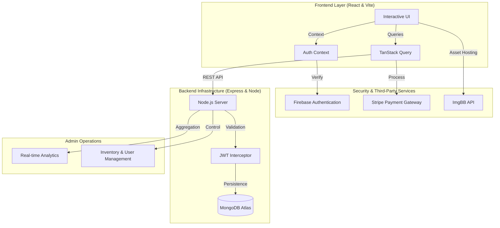

# 🍔 Foodi | Enterprise-Grade MERN Stack Food Delivery Platform

[](https://vercel.com)
[](https://reactjs.org/)
[](https://nodejs.org/)
[](https://www.mongodb.com/)
[](https://tailwindcss.com/)
[](https://firebase.google.com/)

---

## 📖 Executive Summary

**Foodi** is a comprehensive, full-stack digital ecosystem designed to streamline the food delivery lifecycle. Developed using the **MERN (MongoDB, Express, React, Node.js)** architecture, it serves as a robust bridge between culinary establishments and their customers.

The platform is engineered for high performance, featuring a fluid user interface, real-time order synchronization, and an advanced administrative backend. By integrating cutting-edge technologies like **Firebase Auth**, **Stripe Payments**, and **TanStack Query**, Foodi ensures security, scalability, and an unparalleled user experience.

---

## 📊 High-Level System Architecture

The following diagram illustrates the seamless data flow and integration between the frontend client, backend server, and third-party cloud services.



---

## 🌟 Core Modules & Functionalities

### 1. Dynamic Customer Interface

- **Responsive Menu Engine**: Advanced filtering and search capabilities allowing users to navigate through thousands of items effortlessly.
- **Interactive Cart Management**: Persistent shopping cart with real-time price updates and quantity controls.
- **Live Order Visualization**: A sophisticated progress-tracking system (Pending → Cooking → On the way → Delivered) that keeps customers informed at every stage.
- **Premium User Profile**: Custom account management dashboard for profile updates and order history tracking.
- **Support Ecosystem**: Integrated FAQ and customer support channels for enhanced user trust.

### 2. Advanced Administrative Engine

- **Strategic Dashboard**: Visualized data metrics for total revenue, user registration trends, and order volume.
- **Inventory Lifecycle Management**: Full CRUD (Create, Read, Update, Delete) suite for menu engineering, including automated image hosting.
- **Order Orchestration**: Real-time management of active bookings and status transitions.
- **User Governance**: Centralized directory for user oversight and role-based access control (Admin/User).
- **Public Demo Mode**: A specialized **Read-Only** mode for the admin panel, allowing visitors to explore the interface while protecting data integrity.

---

## 🛠️ Technical Specifications

| Layer        | Technology                    | Purpose                                             |
| :----------- | :---------------------------- | :-------------------------------------------------- |
| **Frontend** | React 18, Tailwind CSS        | High-performance, responsive UI development.        |
| **State**    | TanStack Query, React Context | Efficient data fetching, caching, and global state. |
| **Backend**  | Node.js, Express.js           | Robust RESTful API architecture.                    |
| **Database** | MongoDB, Mongoose             | Scalable, document-oriented data storage.           |
| **Auth**     | Firebase Auth + JWT           | Multi-layered security and session management.      |
| **Payments** | Stripe API                    | Secure, PCI-compliant payment processing.           |
| **Hosting**  | Vercel (Monorepo)             | High-availability cloud deployment.                 |

---

## 📁 Project Governance Structure

```bash
├── foodi-client/          # Frontend Domain (React/Vite)
│   ├── src/
│   │   ├── components/    # Reusable Atomic UI units
│   │   ├── contexts/      # Global state providers
│   │   ├── hooks/         # Logic extractors (Axios Secure, Admin Check)
│   │   ├── pages/         # High-level views (Shop, Dashboard, Auth)
│   │   └── routes/        # Dynamic application routing
└── foodi-server/          # Backend Domain (Node/Express)
    ├── api/
    │   ├── controllers/   # Business logic implementations
    │   ├── middleware/    # Security & Validation layers (JWT, Admin Check)
    │   ├── models/        # Mongoose data schemas
    │   └── routes/        # Secure REST API endpoints
```

---

## 🚀 Deployment Strategy

The application is architected as a **Monorepo** for optimized CI/CD workflows on Vercel. The root-level `vercel.json` ensures intelligent routing, proxying API requests to the server while serving static assets via the client.

---

_Developed with a commitment to excellence and professional software standards._
